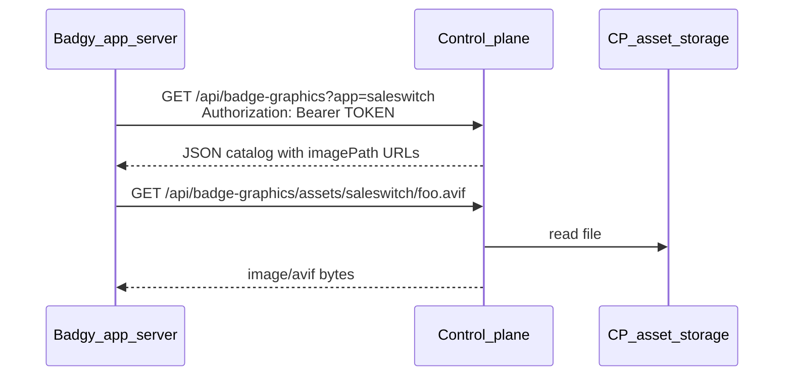

# Badge graphic gallery (cp-app-settings)

Portfolio-wide IMAGE badge presets are **owned by the control plane** (metadata in
`badge_graphics`, files in storage). The SaleSwitch/Badgy app **reads** the catalog;
it never writes badge content to its own DB.

## Why thumbnails were blank locally

Seed rows point at `/api/badge-graphics/assets/saleswitch/<slug>.avif`, but those
files only exist after you either:

1. **Fallback (recommended for local dev)** — set `BADGE_GRAPHIC_FALLBACK_DIR` to the
   Badgy public folder so the CP asset route serves AVIFs without copying them, or
2. **Import** — run `npm run import:badgy-badges` to copy AVIFs into
   `./data/badge-graphics/saleswitch/` and upsert the full catalog from
   `badgy/shared/badgeGraphicCatalog.ts`.

## Local setup (two repos on one machine)

```bash
# In app-control-plane/.env
BADGE_GRAPHIC_FALLBACK_DIR="../badgy/public/images/badge-graphics"

# Optional: full catalog in DB (not just the 5 seed fixtures)
npm run import:badgy-badges
```

Restart `npm run dev`. Thumbnails load via
`GET /api/badge-graphics/assets/saleswitch/minimal-sale.avif` — CP reads from
fallback when the file is missing in `./data/badge-graphics/`.

## Cross-server connection (Badgy ↔ Control plane)



### Control plane (publisher)

| Env | Purpose |
|-----|---------|
| `BADGE_GRAPHIC_READ_TOKEN` | Bearer token Badgy presents to `GET /api/badge-graphics` |
| `BADGE_GRAPHIC_PUBLIC_BASE_URL` | e.g. `https://cp.apoaap.io` — API returns absolute `imagePath` values |
| `BADGE_GRAPHIC_STORAGE_DIR` | Writable storage for uploads + imported assets (S3 mount in prod) |
| `BADGE_GRAPHIC_FALLBACK_DIR` | **Dev only** — leave empty in production |

### Badgy (consumer)

| Env | Purpose |
|-----|---------|
| `CONTROL_PLANE_URL` | e.g. `http://localhost:3000` |
| `BADGE_GRAPHIC_READ_TOKEN` | Same bearer token as CP `BADGE_GRAPHIC_READ_TOKEN` |
| `CONTROL_PLANE_APP_KEY` | Registry app key (default `saleswitch`) |

```bash
# app-control-plane/.env
BADGE_GRAPHIC_READ_TOKEN="dev-badge-graphic-read"

# badgy/.env  (CP dev-up.sh uses port 5173 by default)
CONTROL_PLANE_URL="http://localhost:5173"
BADGE_GRAPHIC_READ_TOKEN="dev-badge-graphic-read"
```

Restart both dev servers after changing env. The badge picker polls the CP catalog
every 10 seconds while open — no restart needed for add/delete/archive after that.

### Default image badge

Set the portfolio default at **Settings → Badge graphics → Default image badge**.
The chosen slug is returned as `defaultSlug` on `GET /api/badge-graphics` and
auto-applied in SaleSwitch when a merchant first switches to Image badge.
Built-in fallback slug: `retro-sale`.

## Management

ADMIN-only (`settings:manage`) at **Settings → Badge graphics**. Mutations are
audited (`badge.graphic.*`). Uploads land in `BADGE_GRAPHIC_STORAGE_DIR` and take
precedence over the fallback path.
